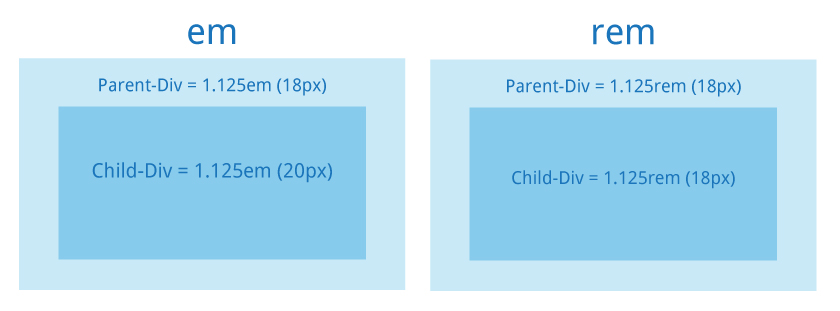

# 3.8. Единицы измерения в CSS

Существует много свойств CSS, которые требуют **размер в качестве единицы**:



* **font-size** определяет размер текста;
* **border-width** определяет толщину границ элементов;
* **margin** определяет пространство между элементами;
* **left/right/top/bottom** позволяют позиционировать и перемещать элементы.

 **Наиболее часто используемые единицы**:

* px для пикселей;
* % для процентов;
* em для определения размера относительно родительского значения font-size.

###  <a id="px"></a>

### Пиксели `(px)` <a id="px"></a>

Поскольку компьютерные экраны используют пиксели для отображения содержимого, это **самая распространённая единица размера в CSS**.Пиксель может быть использован для задания фиксированной **ширины** элемента:

```text
CSS:
    body { width: 400px; }
```

Или установить **размер текста**:

```text
CSS:
    body { font-size: 20px; }
```

Пиксели в CSS являются простыми, поскольку они определяют **абсолютные значения** и не зависят от других наследуемых свойств CSS.Они также широко используются для **позиционирования** и **расстояния**.

###  <a id="h2-28"></a>

### Проценты `(%)` <a id="h2-28"></a>

Проценты — это **относительные единицы**: они полагаются на родителя и/или предка элемента.К примеру, блочные элементы, такие как абзацы, естественным образом занимают **всю доступную ширину**. Следующее правило CSS изменит их размер до **половины** доступной ширины.

```text
CSS:
    p { width: 50%; }
```

Проценты могут помочь задать другие свойства CSS, такие как размер текста.

```text
HTML:
    <p>Есть <strong>важные</strong> проблемы, стоящие перед нами.</p>

CSS:
    strong { font-size: 150%; }
```

### \`\` <a id="em"></a>

### `em` <a id="em"></a>

**em** является относительной единицей и **зависит от значения font-size элемента**.Например, если у родителя font-size задан как 20px и вы применяете font-size: 0.8em к дочернему элементу, то этот дочерний элемент будет отображать font-size как 16px.

❗ Не следует путать размер em с селектором em, который ориентирован на элемент `<em>`.Единица em интересна для определения размера шрифта элементов HTML относительно друг друга. 

Для создания привлекательной и комфортной для чтения веб-страницы вам необходимо обеспечить визуальную глубину. Например, вы хотите, чтобы ваши `<h1>` были вдвое больше, чем основной текст, ваши `<h2>` в 1,5 раза больше, а боковая панель немного меньше. Это можно легко получить в CSS:

```text
CSS:
    body { font-size: 16px; }

    h1 { font-size: 2em; }        /* = 32px */

    h2 { font-size: 1.5em; }      /* = 24px */

    aside { font-size: 0.75em; }  /* = 12px */
```

Если вы решите изменить размер текста `<body>`, относительные размеры заголовков и боковой панели **изменятся соответственно** и ваша веб-страница останется **визуально сбалансированной**.Только изменив одно значение, поменяются и все остальные значения:

```text
CSS:
    body { font-size: 20px; }
    
    h1 { font-size: 2em; }        /* = 40px */
    
    h2 { font-size: 1.5em; }      /* = 30px */
    
    aside { font-size: 0.75em; }  /* = 15px */
```

### \`\` <a id="rem"></a>

### `rem` <a id="rem"></a>

Единица **rem** похожа на em, но вместо зависимости от родительского значения, она **опирается на значение корневого элемента**, которым является элемент `<html>`.

```text
CSS:
    html { font-size: 18px; }
    
    body { font-size: 1rem; }     /* = 18px */
    
    h1 { font-size: 2rem; }       /* = 36px */
    
    h2 { font-size: 1.5rem; }     /* = 27px */
```

❗ Разница между rem и em в том, что значение rem фиксировано, в то время как значения em умножаются друг с другом.

```text
Если вы установили html { font-size: 18px; }:

*   2rem всегда будет равно 36px, независимо от того, где оно используется в вашем CSS;
*   2em всегда будет равно удвоенному font-size родителя, что не обязательно равно 36px.
```

Быстрый пример, где 2em отличается от 2rem:

```text
HTML:
    <p>Есть <strong>важные</strong> проблемы, <span>стоящие</span> перед нами.</p>

CSS:
    html { font-size: 20px; }
    
    p { font-size: 0.8rem; }        /* = 16px */
    
    p span { font-size: 2em; }      /* = 16px * 2 = 32px */
    
    p strong { font-size: 2rem; }   /* = 20px * 2 = 40px */
```

`<span>` полагается на значение font-size у `<р>`, в то время как `<strong>` полагается на значение font-size у `<html>`.Если размер в em/rem изменить, задав его больше единицы, то шрифт увеличится. Если его задать меньше единицы, то шрифт уменьшится. Т.е. цифра рядом с единицей em является множителем для размера шрифта.


###  <a id="h2-31"></a>

### Какую единицу использовать? <a id="h2-31"></a>

Наверное, лучше всего все-таки начать с **пикселей**: поскольку это абсолютная величина, они не зависят от контекста элемента. Пиксели простые, позволяют установить размер текста, ширину и высоту изображения, толщину границы, координаты положения и др.**Проценты** и значения **em** могут быть использованы наряду с пикселями, особенно для относительных размеров текста.

| Единица измерения | Описание | Пример использования единицы измерении |
| :---: | :--- | :--- |
| % | Устанавливает измерение в процентах относительно другого значения, как правило, охватывающего элемента. | div {width: 50%;} |
| em | Относительное измерение высоты шрифта в em пространстве. Поскольку единица em эквивалентна размеру данного шрифта, то, если Вы укажите шрифт 12pх, каждый элемент «em» будет 12pх. Таким образом, 2em будет 24pх. | h1 {letter-spacing: 3em;} |
| px | Устанавливает измерение в пикселях экрана. | p {margin: 30px;} |
| vh | Равен 1% высоты окна просмотра. | h1 {font-size: 2.1vh;} |
| vw | Равен 1% ширины окна просмотра. | h2 {font-size: 2.2vw;} |
| vmin/vmax | Равен 1vw или 1vh, в зависимости от того, что меньше. | div {font-size: 5vmin;} |

##  <a id="triangularflagonpost11css"></a>

