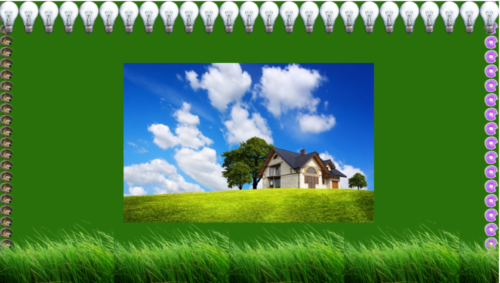

# HomeWork 4

### **1.Первый уровень**

Скопируйте любой текст с интернета и дайте ему следующие стили:

1. размер шрифта 20px;
2. межстрочный интервал 25px;
3. отступ первой строки 40px;
4. межбуквенный интервал 1px;
5. любой понравившийся шрифт из семейства шрифтов `sans-serif`;
6. интервалы между словами 5px;
7. для блока c текстом задать внутренню тень;


### **2.Второй уровень**

У вас есть html, котрый нельзя изменить. Используем только стили!

```text
<div class="bg-box"></div>
```



 **Ссылки на картинки:** [Дом](https://img2.goodfon.ru/wallpaper/big/0/5b/pole-zelen-trava-dom-derevya.jpg) , [Трава](https://www.freeiconspng.com/uploads/grass-png-images-pictures-transparent-28.png), [Лампочка](https://www.freeiconspng.com/uploads/lamp-png-0.png), [Еж](https://vignette.wikia.nocookie.net/mashaandthebear/images/e/e0/%D0%81%D0%B6%D0%B8%D0%BA.png/revision/latest?cb=20180209130328&path-prefix=ru), [Пончик](https://avatanplus.com/files/resources/mid/58eb07b830eab15b56162788.png)

### 

### **3.Первый уровень \(“псевдоклассы рулят!”\)**

Создайте список из 10 пунктов:

```text
<ul>
    <li>
        <a href="#">Text</a>
    </li>
    ...
</ul> 
```


Используя стили для тегов, псевдоселекторов/псевдоклассов, сделайте так чтобы:

* убрать list-style \(чтобы перед &lt;li&gt; не было “точек”\)
* первый пункт был зеленого цвета \(color\);
* все четные элементы &lt;li&gt; имели размер шрифта \(font-size\) 20px, остальные - 18px;
* у каждого третьего элемента \(начиная с 1-го !\) был желтый фон \(background\);
* уберите underline \(подчеркивание\) у ссылок. Пропишите стили на ховер \(:hover\) на ваше усмотрение
* с помощью псевдоэлемента перед каждым пунктом списка &lt;li&gt; вставить “-”

Результат должен быть таким:


### **4. Дополнительное задание \(“смогубольше”\) - по желанию**

У вас есть следующий код:

```text
HTML:
    <p>Пример 1</p>
    <div class="box1"></div>
    
    <p>Пример 2</p>
    <div class="box2"></div>
    
    <p>Пример 3</p>
    <div class="box3"></div>
    
CSS:
    div[class^='box'] {
        width: 100px;
        height: 100px;
    }
```

Прописать **градиент**, чтобы получились блоки следующего вида:


