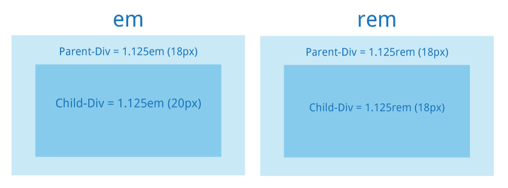

# CSS - part1

## 1. Что такое CSS.

**C**ascading **S**tyle **S**heets \(**CSS**\) — “каскадные таблицы стилей” — формальный язык описания внешнего вида документа, написанного с использованием языка разметки.

> CSS= визуальное оформление

> Актуальная версия: CSS 3.

**Каскадные таблицы стилей \(CSS\)** используются для описания внешнего вида документа, написанного языком разметки. CSS привносит **жизнь** в HTML-документ, выбирая шрифты, применяя цвета, определяя отступы, позиционируя элементы, анимируя взаимодействия и многое другое.**Объявление стиля состоит из двух частей:** элемента веб-страницы — **селектора**, и команды форматирования — **блока объявления**.Вы можете прочитать это так:


```text
КТО { ЧТО: КАК; }


или


СЕЛЕКТОР {СВОЙСТВО: ЗНАЧЕНИЕ}
```

Такой блок называется **«CSS-правило»**. Каждое CSS-правило содержит хотя бы один селектор и свойство.CSS представляет собой процесс из трех частей:

* **селектор** определяет, на какой элемент или элементы нацелиться;
* **свойство** определяет характеристики для изменения;
* **значение** определяет, как изменить эту характеристику.

❗ значение отделяется от имени двоеточием;

❗ каждая пара "свойство: значение" заканчивается точкой с запятой;

Вообще, CSS довольно элементарный формальный язык, который придумали для описания внешнего вида документов. Это говорит о том, что он довольно прост и состоит из самобытных примитивных конструкций, которые не так сложны для изучения. Самое сложное не синтаксис, не правила написания конструкций, а огромное количество CSS свойств для запоминания, которые выполняют различные задачи.


```text
HTML:   <h1>Title</h1>

CSS:    h1 {
            color: red;
            font-size: 18px;
        }
```

Здесь для элемента h1 установлен красный цвет \(color: red\) и размер шрифта \( font-size: 18px \)

## 2. Способы задания стилей <a id="triangularflagonpost2"></a>

### 2.1. Внешняя таблица стилей <a id="_21"></a>

Включает в себя подключение стилей _**через текстовый файл с расширением .css**_.

Она подключается к веб-странице с помощью тега `<link>`. Лучше подключать стили внутри `<head>`, но это необязательно. Тег `<link>` будет работать и в другом месте страницы. 

К каждой веб-странице можно присоединить несколько таблиц стилей, добавляя последовательно несколько тегов `<link>`, указав в атрибуте тега `media` назначение данной таблицы стилей \([https://msiter.ru/references/html-reference/link/media](https://msiter.ru/references/html-reference/link/media)\). 

`rel="stylesheet"` указывает тип ссылки \(ссылка на таблицу стилей\).

```text
<head>
    <link media="all" rel="stylesheet" href="css/main.css">
    <link media="all" rel="stylesheet" href="css/assets.css">
</head>
```

\*\*\*\*➕ **Преимущества внешних CSS:**

* Меньший размер страницы HTML и более чистая структура файла.
* Быстрая скорость загрузки.
* Для разных страниц может быть использован один и тот же **.css** файл.

\*\*\*\*➖ **Недостатки внешних CSS:**

* Страница может некорректно отображаться до полной загрузки внешнего CSS.

### 2.2. Внутренние стили <a id="_22"></a>

**Внутренние стили** встраиваются в раздел `<head></head>` HTML-документа и определяются внутри тега `<style></style>`. Внутренние стили имеют приоритет над внешними, но уступают встроенным стилям \(заданным через атрибут style\).

```text
<head>
    <style>
        h2 {
            font-size: 28px;
            line-height: 32px;
        }
    </style>
</head>
```

При таком варианте подключения классы и идентификаторы \(ID\) могут быть использованы для обращения к CSS коду, однако, они _**будут активны только на этой конкретной странице**_.

 CSS стили подключенные таким путем загружаются при каждой повторной загрузке страницы, поэтому они _могут повлиять на скорость ее загрузки_.

### 2.3. Встроенные \(инлайновые\) стили <a id="_23"></a>

Инлайновые стили - это когда CSS-код в HTML-файле _**непосредственно внутри тега элемента**_ с помощью атрибута style:

```text
<h2 style="font-size: 32px;">Heading 2</h2
```

##  3. Селекторы CSS <a id="triangularflagonpost3css"></a>

Так же, как в HTML есть теги, в CSS есть "селекторы".

**Селекторы** – это имена стилей, которым вы будете прописывать свойства.

**Свойства** – это ключевые слова, такие как[`color`](https://msiter.ru/references/css-reference/color),[`font-weight`](https://msiter.ru/references/css-reference/font-weight)или [`background-color`](https://msiter.ru/references/css-reference/background-color), которым присвоены определенные значения. 

Значения свойств присваиваются при помощи двоеточия и разделяются точкой с запятой:

```text
body {
   font-size: 12px;
   color: #000;
}
```

**Селекторы бывают:**

* универсальными
* теговый селектор \(селектором элемента\)
* классовый селектор
* селектор идентификатора
* селектор потомка
* дочерний селектор
* соседний селектор
* родственный селектор
* селектор атрибута
* селектор псевдокласса
* селектор псевдоэлементов

### 3.1. Универсальный селектор \(\*\) <a id="_31"></a>

**Универсальный селектор** - соответствует **любому HTML-элементу**.

> **Синтаксис: \* {...}**

```text
* {margin: 0;}      -  обнулит внешние отступы для всех элементов сайта. 
```

Также селектор может использоваться в комбинации с псевдоклассом или псевдоэлементом: `*:after {CSS-стили}`, `*:checked {CSS-стили}`.

### 3.2. Теговый cелектор элемента <a id="_32"></a>

**Теговый селектор** позволяет задавать стили **для всех элементов** данного типа \(тега\).

> **Синтаксис: a {...}**

Допустим, вам нужно изменить шрифт и цвет **всех тегов** `<ul>`, которые имеются на веб-странице:

```text
ul {
    background-color: black;
}
```

### 3.3. Селектор класса \(class\) <a id="_33class"></a>

**Селектор класса** - позволяет задавать стили для одного и более элементов с одинаковым именем класса, размещенных в разных местах страницы. 

> **Синтаксис: .a {...}**

```text
HTML:   

    <div class="main-nav">...</div>
    <h1 class="main-nav">...</h1>
    		  
		  
CSS:

    .main-nav {
        background-color: black;
    }
```

#### Правила написания классов <a id="h3-10"></a>

* в CSS перед названием селектора класса обязательно ставится точка \(но при присвоении класса в HTML-документе эта точка не нужна\);
* в названии классов можно использовать только буквы латинского алфавита, дефис, символ подчеркивания, цифры;
* название класса всегда должно начинаться с буквы \(правильные варианты названий: **.intro**, **.img-border**, **.navmenu01**; неправильные: **.2color**, **.-link**, **.\_divider**;
* названия классов CSS чувствительны к регистру, поэтому классы вроде **.review** и **.Review** будут восприниматься как два отдельных.

### 3.4. Селектор идентификатора \(id\) <a id="_34id"></a>

**Селектор идентификатора**- позволяет задавать стили для конкретного элемента \(_id должен быть уникальным!_\). 

Записывается он почти так же, как и класс, только в CSS вместо точки ставится символ решетки **\#:**

> **Синтаксис: \#a {...}**

```text
HTML:  
    <div id="nav">...</div>

CSS:    
    #nav {
        background-color: black;
    }
```

Давайте рассмотрим разницу между идентификатором и классом. Существует несколько отличий:

* ID – это уникальное название элемента на веб-странице, которое должно встречаться на ней только один раз \(например, шапка сайта и подвал: **id="header"** и **id="footer"**\), в то время как класс может присваиваться нескольким элементам с целью отличать их от остальных;
* идентификаторы удобны для JavaScript-разработчиков, поскольку позволяют получить быстрый доступ к элементу DOM из скриптов \(во многом именно поэтому необходимо, чтобы ID встречался на странице лишь один раз\);
* каждое правило CSS имеет свой так называемый вес \(от веса зависит, какое из правил получит более высокий приоритет при выполнении\). Идентификатор имеет больший вес, чем класс, поэтому, если элементу присвоен и ID, и класс, предпочтение отдается ID.

  ```text
  HTML:
      <p id="text" class="content">текст</p> \
	
  CSS:
      #text {
      	color: yellow;
      }
    
      .content {
      	color: blue;
      }

  ** У ID бOльший вес, поэтому цвет текста будет желтым (yellow).
  ```

* с помощью идентификаторов можно ставить якорные ссылки на определенные элементы веб-страницы. Достаточно присвоить этому элементу ID

### 3.5. Селекторы групп <a id="_35"></a>

**Селекторы групп** позволяют задавать стили сразу нескольким элементам.

> **Синтаксис: a, b, c { … }**

Например, необходимо сделать шрифт жирным для нескольких элементов веб-страницы – `<p>` и `<h1>`. Можно было бы записать этот стиль отдельно для каждого элемента:

```text
p {
    font-weight: bold;
}

h1 {
	font-weight: bold;
}


Можно записать так:

p, h1 {
	font-weight: bold;
}
```

### 3.6. Селектор потомка <a id="_36"></a>

**Селектор потомка** - позволяет задавать стили к элементам, расположенным внутри элемента-контейнера;

> **Синтаксис: a b { ... }**

```text
HTML:   
    <div class="main-nav">
        <a href="#">Link</a>
    </div>  

CSS: 	
    .main-nav a {
	    background-color: black;
	}
```

### 3.7. Дочерний селектор <a id="_37"></a>

**Дочерний селектор** - позволяет задавать стили к элементам, которые являются прямыми потомкам \(т.е. идут сразу за родительским элементом и между ними нет других элементов\);

> **Синтаксис:** **a &gt; b { … }**

```text
HTML:   
    <div class="wrap">
        <p>text with font-size 28px</p>
        <div>
        	<p>text</p>
        </div>
    </div>

CSS:	
    .wrap > p {
	    font-size: 28px;
	}
```

### 3.8. Cоседние селекторы <a id="_38c"></a>

**Cоседние селекторы** - выбирает элемент, который находится непосредственно после указанного элемента, если у них общий родитель.

> **Синтаксис: a + b { … }**

```text
HTML: 
    <div class="box">
        <h1>Title H1</h1>
        <p>some text 1</p>
        <p>some text 2</p>
        <p>some text 3</p>
    </div>

CSS:
h1 + p {
    background: #f00;
}
```

Cелектор `h1 + p` выберет тот `<p>` элемент, который находится непосредственно после элемента `<h1>`.

### 3.9. Родственные селекторы <a id="_39"></a>

**Родственные селекторы** - выбирает все элементы, которые находятся **после указанного элемента, если у них общий родитель**.

> **Синтаксис: a ~ b { … }**

```text
HTML:
    <div class="box">
        <span>к этому элементу стили не пременятся!</span>
        <p>some text 1</p>
        <p>some text 2</p>
        <p>some text 3</p>
        <span>у этого элемента будет красный фон!</span>
        <span>у этого элемента будет красный фон!</span>
    </div>

CSS:
    p ~ span {
      background: #f00;
    }
```

Селектор **p ~ span** выберет все элементы `<span>`, которые находятся после элемента [&lt;p&gt;](https://developer.mozilla.org/ru/docs/Web/HTML/Element/p) внутри одного родителя.

### 3.10. Cелектор атрибута <a id="_310c"></a>

**Cелектор атрибута** - позволяет задавать стили к элементам на основе имени атрибута или значения атрибута;

> **Синтаксис: a\[attr=”value”\] { … }**

```text
HTML:   
    <input type="text">
    <input type="password">

CSS:   
    input[type="text"] {
        font-size: 28px;
    }
```

❗ Селекторы можно объединять, группировать, чтобы добиться желаемого результата

Селекторы атрибутов выбирают элементы на основе имени атрибута или **значения атрибута:**

| атрибут | когда применять |
| :--- | :--- |
| атрибут | все элементы, содержащие указанный атрибут, \[alt\] — все элементы, для которых задан атрибут alt |
| селектор\[атрибут\] | элементы данного типа, **содержащие указанный атрибут**, `img[alt]` — только картинки, для которых задан атрибут `alt` |
| селектор\[атрибут='значение'\] | элементы данного типа, **содержащие указанный атрибут с конкретным значением**, `img[title='flower']` — все картинки, название которых содержит слово flower |
| селектор\[атрибут~='значение'\] | элементы **частично содержащие данное значение**, например, если для элемента задано несколько классов через пробел, `p[class~='feature']` — абзацы, имя класса которых содержит feature |
| селектор\[атрибут\|='значение'\] | элементы, список значений атрибута которых **начинается с указанного слова**, `p[class|='feature']` — абзацы, имя класса которых feature или начинается на feature |
| селектор\[атрибут^='значение'\] | элементы, значение атрибута которых начинается с указанного значения, `a[href^='http://']` — все ссылки, начинающиеся на `http://` |
| селектор\[атрибут$='значение'\] | элементы, значение атрибута которых **заканчивается указанным значением**, `img[src$='.png']` — все картинки в формате `png` |
| селектор\[атрибут\*='значение'\] | элементы, значение атрибута которых содержит в **любом месте** указанное слово, `a[href*='book']` — все ссылки, название которых содержит `book`. |

**Селекторы можно комбинировать, записывая последовательно, без пробела:**

* .c1.c2 – элементы одновременно с двумя классами c1 и c2
* a\#id.c1.c2:visited – элемент a с данным id, классами c1 и c2, и псевдоклассом visited

Почитать еще можно [тут](https://learn.javascript.ru/css-selectors#osnovnye-vidy-selektorov)

##  4. Каскад \(”вес” селекторов\) <a id="triangularflagonpost4"></a>

**Каскадность CSS** – это механизм, благодаря которому к элементу HTML-документа может применяться более чем одно правило CSS. 

Правила могут исходить из различных источников: из внешней и внутренней таблицы стилей, от механизма наследования, от родительских элементов, от классов и ID, от селектора тега, от атрибута **style** и т. д.

Поскольку в этих случаях часто происходит конфликт стилей, была создана система приоритетов: в конечном итоге применяется тот стиль, который исходит от источника с более высоким приоритетом

**1\) специфичность \(”вес” селектора\):**

| Селектор | Вес селектора |
| :--- | :--- |
| Селектор тега \(tag name\): | 1 |
| Селектор класса \(class\): | 10 |
| Селектор ID: | 100 |
| Inline-стиль: | 1000 |

.Когда селектор состоит из нескольких других селекторов, необходимо посчитать их общий вес. Вот как вычисляется приоритет: за каждый селектор добавляется 1 в соответствующую ячейку. В остальных ячейках стоят нули. Чтобы получить общий вес, необходимо «склеить» все числа в ячейках.

| Селектор | ID | Класс | Тег | Общий вес |
| :--- | :--- | :--- | :--- | :--- |
| p | 0 | 0 | 1 | 1 |
| .class | 0 | 1 | 0 | 10 |
| p.class | 0 | 1 | 1 | 11 |
| \#id | 1 | 0 | 0 | 100 |
| \#id p | 1 | 0 | 1 | 101 |
| \#id .class | 1 | 1 | 0 | 110 |
| p a | 0 | 0 | 2 | 2 |

 **2\) порядок -** чем ниже находится селектор по коду, тем его вес выше

```text
p { font-size: 20px; } 

p { font-size: 22px; }
```

Если случилось так, что два селектора имеют одинаковый вес, то приоритет отдается тому стилю, который находится ниже в коде. Если для одного элемента задан стиль и во внешней, и во внутренней таблицах, то приоритет отдается стилю в той таблице, которая находится ниже в коде.**Пример:** во внутренней таблице стилей задан красный цвет для тегов `<p>*`, а во внешней – зеленый цвет для этих же тегов. В HTML-документе вы первым делом подключили внешнюю таблицу стилей, а затем добавили внутреннюю таблицу с помощью тега **`<style>...</style>`**. В итоге цвет тегов `<p>` будет красным.Это – один из способов управлять значимостью стилей. Еще один способ повысить приоритет – специально увеличить вес селектора, например, добавив к нему ID или класс.

**3\) правило !important** \(самый сильный приоритет\):Если вы столкнулись с экстренным случаем и вам необходимо повысить значимость какого-либо свойства, можно добавить к нему объявление **!important**:

```text
h3 { font-size: 20px !important; }

h3 { font-size: 16px; }
```

Также `!important` перекрывает inline-стили. Слишком частое применение `!important` не приветствуется многими разработчиками. В основном, данное объявление принято использовать лишь тогда, когда конфликт стилей нельзя победить иными способами.

## 5. Комбинирование и группировка селекторов <a id="triangularflagonpost5"></a>

Для более точного отбора элементов для форматирования можно использовать комбинации селекторов:

```text
a[href][title] { color: red; }
```

Один и тот же стиль можно одновременно применить к нескольким элементам. Для этого необходимо в левой части объявления перечислить через запятую нужные селекторы:

```text
p,
span { color: black; }
```

### Иерархия селекторов <a id="h2-20"></a>

Пробел в селекторе определяет отношение предок/потомок. Скажем, мы хотим, чтобы ссылки в нашем заголовке были красного цвета:

```text
header a {
    color: red;
}
```

Это можно читать справа налево как: «выбрать все элементы `<a>`, которые находятся внутри элемента `<header>`. Это заставит все другие ссылки \(которые не в заголовке\) оставаться неизменными.

❗ Чем длиннее ряд селекторов, тем дольше обрабатывается CSS-свойства.

## 6. Наследование <a id="triangularflagonpost6"></a>

**Наследование в CSS** — это механизм, с помощью которого значения свойств элемента-родителя передаются его элементам-потомкам. Стили, присвоенные одному элементу, наследуются всеми потомками \(вложенными элементами\), но только в том случае, если они где-то явно не переопределены.Если мы пропишем следующий код в таблицу стилей:

```text
body {
    color: #913D88;
    font-size: 16px;
    border: 1px solid #333;
}
```

, то можем заметить, что текст на странице принял свойства,которые мы прописали для тега `<body>` \(и цвет, и размер шрифта\). А вот рамка **border** появляется только один раз – для тега `<body>`, но не для его дочерних элементов.

Почему рамка не появилась у других элементов веб-страницы? Всё потому, что согласно спецификации CSS, существуют определенные правила наследования.

 Есть свойства, которые наследуются \(в основном, это свойства, определяющие внешний вид текста\) и те, которые **не** наследуются \(например, **border**, а также свойства, определяющие границы, поля, отступы\). 

К тому же, у браузеров есть свои стили, установленные по умолчанию. Именно поэтому стандартная синяя подчеркнутая гиперссылка **a** не будет перенимать от **body** свойство **color**.

Спецификацией CSS предусмотрено наследование свойств, относящихся к текстовому содержимому страницы, таких как `color`, `font`, `letter-spacing`, `line-height`, `list-style`, `text-align`, `text-indent`, `text-transform`, `visibility`, `white-space` и `word-spacing`. Во многих случаях это удобно, так как не нужно задавать размер шрифта и семейство шрифтов для каждого элемента веб-страницы.

**Свойства, относящиеся к форматированию блоков, не наследуются**. Это `background`, `border`, `display`, `float` и `clear`, `height` и `width`, `margin`, `min-max-height` и `-width`, `outline`, `overflow`, `padding`,`position`, `text-decoration`, `vertical-align` и `z-index`.С помощью ключевого слова **inherit** можно принудить элемент наследовать любое значение свойства родительского элемента. Это работает даже для тех свойств, которые не наследуются по умолчанию. Например:

```text
body {
    color: #913D88;
	font-size: 16px;
    border: 1px solid #333;
}

p {
    border: inherit;
}
```

Такой вариант удобен тем, что при необходимости можно внести правки только в стиль для элемента `body`, а на теги `<p>` тратить время не нужно, так как стиль автоматически изменится и для них.

## 7. Псевдоклассы <a id="triangularflagonpost7"></a>

**Псевдокласс** в CSS — это ключевое слово, добавленное к селектору, которое определяет его особое состояние. Например, **:hover** может быть использован для изменения цвета кнопки при наведении курсора на неё.

```text
div:hover {
  background-color: #F89B4D;
}
```

* **:link** — не посещенная ссылка;
* **:visited** — посещенная ссылка;
* **:hover** — любой элемент, по которому проводят курсором мыши;
* **:focus** — интерактивный элемент, к которому перешли с помощью клавиатуры или активировали посредством мыши;
* **:disabled** — заблокированные поля форм, т.е., находящиеся в неактивном состоянии;
* **:not\(селектор\)** — элементы, которые не содержат указанный селектор — класс, идентификатор, название или тип поля формы — :not\(\[type="submit"\]\);
* **:checked** — выделенные \(выбранные пользователем\) элементы формы.

Псевдоклассы дают возможность стилизовать элемент на основе не только отношений в DOM-дереве, но и основываясь на внешних факторах, таких как история посещений \(например, `:visited`\), состояние содержимого \(вроде `:checked` у некоторых элементов формы\) или позиции курсора мыши \(например, `:hover` определяет, находится ли курсор мыши над элементом\)Например: давайте запишем состояние ссылки при разных результатах действия пользователя \(!!! стили обязательно размещайте их в следующей последовательности\):

```text
CSS:
    a:link { color: red; }  /* обычный цвет ссылки */
    a:visited { color: grey; }  /* цвет ссылки, которую пользователь уже посещал */
    a:hover { color: blue; }  /* цвет ссылки, на которую наведен курсор */
    a:active { background-color: yellow; }  /* цвет фона ссылки в момент нажатия на нее */
```

## 8. Структурные псевдоклассы <a id="triangularflagonpost8"></a>

В CSS3 существует ряд псевдоклассов для работы с дочерними элементами. Ниже приведено описание каждого из них, примеры использования, а также отличия между псевдоклассами вида «child» и «of-type».

* **:nth-child\(odd\)** — нечётные дочерние элементы;
* **:nth-child\(even\)** — чётные дочерние элементы;
* **:nth-child\(3n\)** — каждый третий элемент среди дочерних;
* **:nth-child\(n+2\)** — выбирает все элементы, начиная со второго;
* **:nth-child\(-n+2\)** - первые 2
* **:nth-child\(3\)** — выбирает третий дочерний элемент;
* **:first-child** — позволяет оформить только самый первый дочерний элемент тега;
* **:last-child** — позволяет форматировать последний дочерний элемент тега;
* **:only-child** — выбирает элемент, являющийся единственным дочерним элементом;
* **:empty** — выбирает элементы, у которых нет дочерних элементов;

Почитать можно и [тут](https://code.tutsplus.com/ru/tutorials/the-30-css-selectors-you-must-memorize--net-16048)

Потренироваться в использовании можно [тут](https://css-tricks.com/examples/nth-child-tester/)

## 9. Структурные псевдоэлементы <a id="triangularflagonpost9"></a>

Если псевдоклассы записываются с одним двоеточием, то псевдоэлементы – с двумя. Это было внедрено в CSS3 для того, чтобы различать псевдоклассы и псевдоэлементы между собой. Однако раньше этой разницы не существовало и с псевдоэлементами использовалось одно двоеточие. Сейчас браузеры поддерживают оба варианта написания \(но не для всех случаев\). Рассмотрим некоторые псевдоэлементы:

* **::after** – используется вместе со свойством **content** и позволяет вывести необходимые данные после содержимого элемента;
* **::before** – выполняет похожую функцию, что и предыдущий, только выводит данные перед содержимым элемента;
* **::selection** – этот псевдоэлемент распознается браузерами только при использовании двух двоеточий и позволяет установить цвет и фон для текста, который выделен пользователем;
* **::first-letter** – используется для изменения стиля первого символа в тексте элемента;
* **::first-line** – используется для изменения стиля первой строки текста элемента.

Например:

```text
HTML: 
    <p>При выделении этого текста он изменит свой цвет.</p>

CSS:
    p::selection {
        color: #ff0; /* Цвет текста */
        background: #000; /* Цвет фона */
    }
    
    p::first-letter {
        font-family: "Times New Roman", Times, serif; /* Гарнитура шрифта первой буквы */
        font-size: 20px; /* Размер шрифта первого символа */
        color: red; /* Красный цвет текста */
    }
```

Остановимся подробнее на **::after** и **::before**. 

Псэвдоелементы :before и :after предельно просто прописываются в css-коде. Вот простой пример использования:

```text
CSS:
    #example::before {
       content: "#";
    }
    #example::after {
       content: ".";
    }
```

 Здесь важно отметить две вещи:

* **Во первых**, мы указываем на реальный html элемент с помощью строк \#example::before и \#example::after. Приставки после двоеточия, означают, что это стиль не просто элемента, а его псевдоэлементов.
* **Во-вторых**, вы не сможете ничего добавить без свойства **content**, которое указывает, что именно должно отображаться как псевдоэлемент.Вы можете оставить свойство **content** пустым, и создать блок.

```text
CSS:
    #example:before {
       content: "";
       display: block;
       width: 100px;
       height: 100px;
    }
```

Если вы удалите свойство content, псевдоэлемент работать не будет. По крайней мере, это совойство должно оставаться пустым.

Если прописать `normal`, `none` — содержимое псевдоэлемента не отображается. \(полезно, если нужно скрыть ранее заданный псевдоэлемент\)

Контент, который вставляется невидим на html странице. **Он видим только в CSS**. 

Также, вставляемый контент, по умолчанию будет строчным элементом. Чтобы сделать его блочным достаточно указать **display:block;**, указать ширину и высоту блока. Это очень удобно при создании вкладок, кнопок и т.д.

Важно заметить, что псевдоэлементы не наследуют стилей от родительских элементов \(такие как внутренний и внешний отступы\). Поэтому для каждого псевдоэлемента, необходимо указывать свои параметры стилей.

### Возможности псевдоэлеметов `::after` и `::before` <a id="afterbefore"></a>

Что же мы можем вставить с помощью этих псевдоэлементов?

✏ 1. **Символы и текст**. Рассмотрим пример: давайте добавим кавычки в начало и конец текста тега **&lt;blockquote&gt;:**


```text
CSS:
    blockquote::before {
    	content: """;
    }
    
    blockquote::after {
        	content: """;
    }
    
    blockquote::selection {
    	color: #c8f7c5;
    	background-color: #f9f0de;
    }
```

Мы написали стиль для длинных цитат, который добавляет кавычки в начале и в конце содержимого тега **&lt;blockquote&gt;**, а также изменяет цвет и фон выделенного пользователем текста цитаты.Можем вместо кавычек вставить [символы юникода](http://yoksel.github.io/unicode-table/):

```text
CSS:
    blockquote::before {
    	content: "\2728";
    }
```

или текст:

```text
CSS:
    blockquote::before {
        content: "Цитата:";
        color: red;
    }
```

✏ 2. **Изображения в качестве фона**. Давайте перед каждым пунктом списка сделаем вместо “точек”, например, цветочки:

```text
HTML:
    <ul>
      <li>Item 1</li>
      <li>Item 2</li>
      <li>Item 3</li>
      <li>Item 4</li>
      <li>Item 5</li>
    </ul>

CSS:
    li {
      list-style: none;
    }
    
    li:before {
        background-image: url('http://image.flaticon.com/icons/png/512/253/253551.png');
        background-size: 20px 20px;
        background-repeat: no-repeat;
        background-position: 50% 50%;
        display: inline-block;
        width: 25px; 
        height: 20px;
        content:"";
    }
```

✏  3. **Картинку**. Для этого в свойстве content вы можете прописать URL картинки\( как это делается в background\). Важно помнить, что нельзя URL брать в кавычки, это будет значить что контент является текстом.

```text
HTML:
    <p>Lorem ipsum dolor sit amet consectetur adipisicing elit. Perspiciatis, odit?</p>

CSS:
    p:before {
      content: url(https://i.gifer.com/PUM3.gif);
    }
```

✏  4. **Cчетчик** - `<counter>`. С помощью этого значения можно пронумеровать не только списки, но и любые элементы на странице. Например, разделы статьи.

```text
CSS:
    body {
        counter-reset: h2-counter;
        counter-reset: p-counter;
    }
    div{
        counter-increment: h2-counter;
    }
    
    h2:before {
        content: counter(h2-counter) ". ";
    }
    
    p:before {
        content: counter(p-counter) ". ";
        counter-increment: p-counter;
    }
```

✏  5. **Содержимое заданного атрибута** - `attr(<identifier>`\). Удобно использовать для вывода атрибутов `href` в версии для печати и для разных интересных эффектов.

```text
HTML:
    <p>I'm text. <a href="#" title="I'm link">I'm link</a></p>

CSS:
    a {
      position: relative;
    }
    
    a:before {
        content: attr(title);
        position: absolute;
        z-index: 10;
        right: 0;
        top: 0;
        left: 0;
        height: 0;
        overflow: hidden;
        background: red;
        color: #FFF;
        transition: all .3s;
    }
    
    a:hover:before {
        height: 100%;
    }
```

Мы видим, что возможности использования псевдоэлементов достаточно обширны. Нужно лишь знать где их и как применить\)\)

## 10. Единицы измерения в CSS <a id="triangularflagonpost10css"></a>

Существует много свойств CSS, которые требуют **размер в качестве единицы**:



* **font-size** определяет размер текста;
* **border-width** определяет толщину границ элементов;
* **margin** определяет пространство между элементами;
* **left/right/top/bottom** позволяют позиционировать и перемещать элементы.

 **Наиболее часто используемые единицы**:

* px для пикселей;
* % для процентов;
* em для определения размера относительно родительского значения font-size.

### Пиксели `(px)` <a id="px"></a>

Поскольку компьютерные экраны используют пиксели для отображения содержимого, это **самая распространённая единица размера в CSS**.Пиксель может быть использован для задания фиксированной **ширины** элемента:

```text
CSS:
    body { width: 400px; }
```

Или установить **размер текста**:

```text
CSS:
    body { font-size: 20px; }
```

Пиксели в CSS являются простыми, поскольку они определяют **абсолютные значения** и не зависят от других наследуемых свойств CSS.Они также широко используются для **позиционирования** и **расстояния**.

### Проценты `(%)` <a id="h2-28"></a>

Проценты — это **относительные единицы**: они полагаются на родителя и/или предка элемента.К примеру, блочные элементы, такие как абзацы, естественным образом занимают **всю доступную ширину**. Следующее правило CSS изменит их размер до **половины** доступной ширины.

```text
CSS:
    p { width: 50%; }
```

Проценты могут помочь задать другие свойства CSS, такие как размер текста.

```text
HTML:
    <p>Есть <strong>важные</strong> проблемы, стоящие перед нами.</p>

CSS:
    strong { font-size: 150%; }
```

### `em` <a id="em"></a>

**em** является относительной единицей и **зависит от значения font-size элемента**.Например, если у родителя font-size задан как 20px и вы применяете font-size: 0.8em к дочернему элементу, то этот дочерний элемент будет отображать font-size как 16px.

❗ Не следует путать размер em с селектором em, который ориентирован на элемент `<em>`.Единица em интересна для определения размера шрифта элементов HTML относительно друг друга. 

Для создания привлекательной и комфортной для чтения веб-страницы вам необходимо обеспечить визуальную глубину. Например, вы хотите, чтобы ваши `<h1>` были вдвое больше, чем основной текст, ваши `<h2>` в 1,5 раза больше, а боковая панель немного меньше. Это можно легко получить в CSS:

```text
CSS:
    body { font-size: 16px; }

    h1 { font-size: 2em; }        /* = 32px */

    h2 { font-size: 1.5em; }      /* = 24px */

    aside { font-size: 0.75em; }  /* = 12px */
```

Если вы решите изменить размер текста `<body>`, относительные размеры заголовков и боковой панели **изменятся соответственно** и ваша веб-страница останется **визуально сбалансированной**.Только изменив одно значение, поменяются и все остальные значения:

```text
CSS:
    body { font-size: 20px; }
    
    h1 { font-size: 2em; }        /* = 40px */
    
    h2 { font-size: 1.5em; }      /* = 30px */
    
    aside { font-size: 0.75em; }  /* = 15px */
```

### `rem` <a id="rem"></a>

Единица **rem** похожа на em, но вместо зависимости от родительского значения, она **опирается на значение корневого элемента**, которым является элемент `<html>`.

```text
CSS:
    html { font-size: 18px; }
    
    body { font-size: 1rem; }     /* = 18px */
    
    h1 { font-size: 2rem; }       /* = 36px */
    
    h2 { font-size: 1.5rem; }     /* = 27px */
```

❗ Разница между rem и em в том, что значение rem фиксировано, в то время как значения em умножаются друг с другом.

```text
Если вы установили html { font-size: 18px; }:

*   2rem всегда будет равно 36px, независимо от того, где оно используется в вашем CSS;
*   2em всегда будет равно удвоенному font-size родителя, что не обязательно равно 36px.
```

Быстрый пример, где 2em отличается от 2rem:

```text
HTML:
    <p>Есть <strong>важные</strong> проблемы, <span>стоящие</span> перед нами.</p>

CSS:
    html { font-size: 20px; }
    
    p { font-size: 0.8rem; }        /* = 16px */
    
    p span { font-size: 2em; }      /* = 16px * 2 = 32px */
    
    p strong { font-size: 2rem; }   /* = 20px * 2 = 40px */
```

`<span>` полагается на значение font-size у `<р>`, в то время как `<strong>` полагается на значение font-size у `<html>`.Если размер в em/rem изменить, задав его больше единицы, то шрифт увеличится. Если его задать меньше единицы, то шрифт уменьшится. Т.е. цифра рядом с единицей em является множителем для размера шрифта.


### Какую единицу использовать? <a id="h2-31"></a>

Наверное, лучше всего все-таки начать с **пикселей**: поскольку это абсолютная величина, они не зависят от контекста элемента. Пиксели простые, позволяют установить размер текста, ширину и высоту изображения, толщину границы, координаты положения и др.**Проценты** и значения **em** могут быть использованы наряду с пикселями, особенно для относительных размеров текста.

| Единица измерения | Описание | Пример использования единицы измерении |
| :--- | :--- | :--- |
| % | Устанавливает измерение в процентах относительно другого значения, как правило, охватывающего элемента. | div {width: 50%;} |
| em | Относительное измерение высоты шрифта в em пространстве. Поскольку единица em эквивалентна размеру данного шрифта, то, если Вы укажите шрифт 12pх, каждый элемент «em» будет 12pх. Таким образом, 2em будет 24pх. | h1 {letter-spacing: 3em;} |
| px | Устанавливает измерение в пикселях экрана. | p {margin: 30px;} |
| vh | Равен 1% высоты окна просмотра. | h1 {font-size: 2.1vh;} |
| vw | Равен 1% ширины окна просмотра. | h2 {font-size: 2.2vw;} |
| vmin/vmax | Равен 1vw или 1vh, в зависимости от того, что меньше. | div {font-size: 5vmin;} |

## 11. Комментарии в CSS <a id="triangularflagonpost11css"></a>

Комментарии используются для добавления поясняющих заметок или для того, чтобы предотвратить интеграцию части кода в браузер.Синтаксис коментирования CSS следующий:

```text
/* Однострочный комментарий */ 


/* Комментарий 
который содержит 
несколько строк */
```

## 12. `background`. Фон. <a id="triangularflagonpost12background"></a>

Фон на веб-странице — это очень важно, поэтому для него предусмотрено немало свойств. Все они начинаются словом «Background». В переводе с английского «Background» и означает «Фон». О правилах оформления фона через CSS и пойдёт речь в статье.

### `background-color` <a id="backgroundcolor"></a>

Мы уже говорили о свойстве **color**, которое позволяет задать цвет переднего плана элемента, то есть букв текста. **background-color** устанавливает задний фон любого HTML-элемента: таблицы, абзаца, списка и т. д.Например, цвет фона всей страницы можно настроить так:

```text
body { background: #EEFFCB; }
```

### `background-image` <a id="backgroundimage"></a>

Устанавливает в качестве фона картинку. Если изображение подобрано правильно, то страница на его фоне будет выглядеть гораздо красивее, чем на фоне одноцветном.Например, картинка background.png хранится в той же папке, что и веб-страница, и вы хотите установить её как фон параграфам этого HTML-документа. Код будет таким:

```text
    p { background-image: url(background.png); }
```

Для одного и того же веб-элемента можно установить несколько фоновых рисунков. Для этого достаточно перечислить их все в свойстве **background-image** через запятую:

```text
    body { background-image: url(”image/background01.png”), url(”image/background02.png”), url(”image/background03.png”), url(”image/background04.png”); }
```

Очевидно, что без определённого позиционирования выбранные рисунки при отображении будут накладываться друг на друга, причём первое из перечисленных будет самым верхним, последнее — под всеми, задним фоном.

### `background-repeat` <a id="backgroundrepeat"></a>

По умолчанию фоновое изображение, если его размер меньше размера элемента, будет заполнять объект полностью, повторяясь с левого верхнего к правому нижнему углу.Бывают ситуации, когда такое заполнение неприемлемо. Как раз для них и существует свойство **background-repeat**, которому можно указать следующие значения:


| property | comment |
| :--- | :--- |
| **repeat** | Задано по умолчанию. Результат вы видели на рисунке выше. |
| **repeat-x** | Картинка будет повторяться только слева направо, по горизонтали. По вертикали не будет, так что заполнит только первый слой. |
| **repeat-y** | Рисунок будет повторяться по вертикали, но не по горизонтали, то есть идти вдоль левой границы страницы. |
| **no-repeat** | Фон не будет повторяться вообще. |

 

### `background-position` <a id="backgroundposition"></a>

Позволяет задать позицию фоновому изображению, ведь не всегда нужно, чтобы оно отображалось с левого верхнего угла окна браузера. Для позиционирования достаточно указать два значения через пробел: координату по оси X \(горизонтальное позиционирование\) и координату по оси Y \(позиционирование вертикальное\). Задавать их можно в любых единицах длины, но для абсолютных значений рекомендуется использовать пиксели \(**px**\), а для относительных — проценты \(**%**\).

```text
    background-position: 200px 350px;
```

Также картинку можно позиционировать зарезервированными словами.

| property | comment |
| :--- | :--- |
| **left**, **center** и **right** | Для горизонтального расположения используются слова \(по левому краю, по центру и по правому краю соответственно\) |
| **top**, **center** и **bottom** | позиционирование сверху, по центру и снизу.. |

### `background-attachment` <a id="backgroundattachment"></a>

Определяет, будет ли фоновая картинка прокручиваться вместе с содержимым страницы или будет оставаться неподвижной. Значения могут быть такими:

| property | comment |
| :--- | :--- |
| **fixed** | фон зафиксирован |
| **scroll** | фон разблокирован \(прокручивается\) |
| **local** | рисунок прокручивается только с содержимым элемента, но дальше, если элемент уже закончился, не идёт. |

**Если изображений несколько**, для них можно указать правила, перечислив их в одном свойстве background-attachment через запятую:

```text
    background-attachment: fixed, scroll, local;
```

### `background-clip` <a id="backgroundclip"></a>

Определяет, как фоновое изображение или цвет фона будут выводиться относительно границ элемента. 


| property | comment |
| :--- | :--- |
| **content-box** | фон отображается только под содержимым. |
| **border-box** | выводится и под контентом, и под границами |
| **padding-box** | отображается внутри границ. |

### `background-origin` <a id="backgroundorigin"></a>

То же, что и **background-clip**, с такими же значениями, только задаёт положение относительно границ не текущего элемента, а элемента-родителя.

### `background-size` <a id="backgroundsize"></a>

Свойство указывает браузеру размеры фонового изображения. Вы можете задать их в любых единицах длины \(через пробел указывается сначала ширина, потом высота картинки\). Если прописано только одно значение, то оно определит ширину, высота при этом останется исходной, то есть такой, как в файле изображения. Чтобы указать только высоту, а ширину оставить оригинальной, свойству **background-size** нужно задать значения auto размер \(например, background-size: auto 300px\).В правиле можно использовать ещё два значения.

| property | comment |
| :--- | :--- |
| **cover** | Масштабирует фон по размерам блока с сохранением исходных пропорций картинки, то есть рисунок не растянется и не станет слишком узким. |
| **contain** | Помещает изображение внутрь блока, сохраняет пропорции. |

### `background` <a id="background"></a>

Позволяет объединить значения перечисленных свойств в одной строке:

```text
    background: url("background.jpg") center center / 100px 100px no-repeat content-box;
```

В примере между свойствами **background-position** и **background-size** стоит слеш \(**/**\), которым их значения друг от друга необходимо отделять, дабы не запутывать браузер.

## 13. Прозрачность - `opacity` <a id="triangularflagonpost13opacity"></a>

Определяет уровень прозрачности элемента веб-страницы. При частичной или полной прозрачности через элемент проступает фоновый рисунок или другие элементы, расположенные ниже полупрозрачного объекта**Значение по умолчанию**: 1**Синтаксис:**

```text
    opacity: <число>
```

В качестве значения выступает число из диапазона \[0.0; 1.0\]. Значение 0 соответствует полной прозрачности элемента, 1, наоборот — его непрозрачности. Дробные числа вида 0.6 устанавливают полупрозрачность. Допускается писать числа без нуля впереди, вида opacity: .6.

## 14. Текст. Стили для форматирования текста. <a id="triangularflagonpost14"></a>

Свойства CSS для форматирования текста позволяют оформить содержимое страницы, не затрагивая HTML-код. В этом уроке узнаем, какие же параметры можно задать тексту через таблицу стилей

### `text-transform` <a id="texttransform"></a>

Свойство **text-transform** стилизует текст. Оно не влияет на базовое содержимое и не должно влиять на содержимое операции копирования и вставки простого текста.Свойство наследуется.

| property | comment |
| :--- | :--- |
| **none** | Значение по умолчанию, означает отсутствие эффектов. |
| **capitalize** | Изменяет написание первой буквы каждого слова в элементе, делая её прописной. |
| **uppercase** | Выводит все слова в элементе прописными буквами. |
| **lowercase** | Выводит все слова в элементе строчными буквами. |
| **initial** | Устанавливает значение свойства в значение по умолчанию. |
| **inherit** | Наследует значение свойства от родительского элемента. |

**Синтаксис**

```text
    text-transform: none/capitalize/uppercase/lowercase/inherit/initial;
```

### `text-indent` <a id="textindent"></a>

Свойство **text-indent** позволяет задать отступ\(пустое место\) первой строки текста. Например, так можно отформатировать абзацы, чтобы лучше визуально отделить их друг от друга. В качестве значения используется цифра, задающая длину в процентах, единицах или пикселях. Отрицательное число превратит отступ в выступ.**Синтаксис:**

```text
    text-indent: 20px/15%/inherit
```

### `white-space` <a id="whitespace"></a>

Свойство white-space обрабатывает пробелы между словами и переносы строк внутри элемента. Свойство наследуется.

| property | comment |
| :--- | :--- |
| **normal** | Значение по умолчанию. Между словами вставляется только по одному пробелу, дополнительные пробелы отбрасываются. Текст переносится только в случае необходимости. |
| **nowrap** | Запрещает переносы строк, за исключением применения `<br>`. |
| **pre** | Пробелы в тексте не игнорируются, браузер отображает дополнительные пробелы и переносы строк. |
| **pre-wrap** | Сохраняет пробелы в тексте, делая разрывы строк там, где это необходимо. |
| **pre-line** | Удаляет лишние пробелы, за исключением случаев `<br>`. |
| **break-spaces** | Поведение идентично pre-wrap, за исключением того, что: любая последовательность неудаляемых пробелов всегда занимает место, в том числе в конце строки; возможность переноса строки существует после каждого неудаляемого пробела, в том числе между пробелами. |
| **initial** | Устанавливает значение свойства в значение по умолчанию.. |
| **inherit** | Наследует значение свойства от родительского элемента. |

**Синтаксис**

```text
    white-space: normal/nowrap/pre/pre-wrap/pre-line/break-spaces/inherit/initial;
```

### `word-break` <a id="wordbreak"></a>

Свойство **word-break** указывает, как делать перенос строк внутри слов, которые не помещаются по ширине в заданную область. Свойство наследуется.

| property | comment |
| :--- | :--- |
| **normal** | Разрыв допускается в пределах слов. Перенос слов не применяется. |
| **break-all** | Разрыв допускается в пределах слов. Перенос слов не применяется. |
| **keep-all** | Запрещает разрывы между парами символов. |
| **initial** | Устанавливает значение свойства в значение по умолчанию. |
| **inherit** | Наследует значение свойства от родительского элемента. |

**Синтаксис**

```text
    word-break: normal/break-all/keep-all/inherit/initial;
```

### `word-wrap` <a id="wordwrap"></a>

Свойство **word-wrap** указывает, переносить или нет длинные слова, которые не помещаются по ширине в заданную область. Свойство наследуется.**Синтаксис**

```text
    word-wrap: normal | break-word
```

| property | comment |
| :--- | :--- |
| **normal** | Строки не переносятся или переносятся в тех местах, где явно задан перенос \(например, с помощью `<br>`\). |
| **break-word** | Перенос строк добавляется автоматически, чтобы слово поместилось в заданную ширину блока. |

Пример:

```text
HTML:

    <div class="col">
       <p>Cуществительное</p>
       <p>высокопревосходительство</p>
       <p>Одушевленное существительное</p>
       <p>одиннадцатиклассница</p>
       <p>Химическое вещество</p>
       <p>метоксихлордиэтиламинометилбутиламиноакридин</p>
      </div>

CSS:
    .col { 
        background: #f0f0f0; /* Цвет фона */
        width: 230px; /* Ширина блока */
        padding: 10px; /* Поля */
        font-size: 1.5em; /* Размер шрифта */
        word-wrap: break-word; /* Перенос слов */ 
    }
```

### `word-spacing` , `letter-spacing` <a id="wordspacingletterspacing"></a>

CSS позволяет контролировать промежутки между словами и типографскими символами с помощью свойств word-spacing и letter-spacing.Свойство **word-spacing** определяет интервалы между словами. Можно использовать положительные и отрицательные значения. Свойство наследуется.Свойство **letter-spacing** определяет межбуквенный интервал. Свойство наследуется.**Синтаксис:**

```text
    word-spacing: normal/1px/0.2e/50%/inherit/initial;
```

| property | comment |
| :--- | :--- |
| **normal** | Дополнительный интервал не применяется. Вычисляет в 0. Значение по умолчанию. |
| **размер** | Задает дополнительный интервал в дополнение к внутреннему интервалу между словами, определенному шрифтом. Значения могут быть отрицательными, но могут быть ограничения, зависящие от реализации. |
| **initial** | Устанавливает значение свойства в значение по умолчанию. |
| **inherit** | Наследует значение свойства от родительского элемента. |

## 15. `Font`. Стили для шрифта <a id="triangularflagonpost15font"></a>

В файле CSS вы можете настроить несколько свойств шрифта: **font-family, font-size, font-style**. Это наиболее часто используемые свойства шрифта.

### `font-family` <a id="fontfamily"></a>

Свойство **font-family** задает шрифт для элемента.Может содержать несколько "запасных" названий шрифтов. В случае если первый из списка не установлен на компьютере пользователя, используется второй.Существует два типа названия шрифтов:1\) **family-name** - название семьи шрифтов. Например, "times", "courier", "arial"... 2\) **generic-family** - универсальные семейства шрифтов, такое как "serif", "sans-serif", "cursive", "fantasy", "monospace".**Универсальные семейства шрифтов:**

* **serif** — шрифты с засечками \(антиквенные\), типа Times;
* **sans-serif** — рубленные шрифты \(шрифты без засечек или гротески\), типичный представитель — Arial;
* **cursive** — курсивные шрифты;
* **fantasy** — декоративные шрифты;
* **monospace** — моноширинные шрифты, ширина каждого символа в таком семействе одинакова.

❗ Начните с нужного шрифта и всегда заканчивайте названием семейства, чтобы браузер мог выбрать аналогичный шрифт в семействе, если другие шрифты недоступны.

**Примечание**. Разделяйте каждое значение запятой. Если имя шрифта содержит пробел, оно должно быть заключено в кавычки.

**Синтаксис:**

```text
    font-family: <шрифт> [, <шрифт>[, ...]]
```

**Значения:** Любое количество имен шрифтов разделенных запятыми.

* serif — шрифты с засечками \(антиквенные\), типа Times;
* sans-serif — рубленные шрифты \(шрифты без засечек или гротески\), типичный представитель Arial;
* cursive — курсивные шрифты;
* fantasy — декоративные шрифты;
* monospace — моноширинные шрифты, ширина каждого символа в таком семействе одинакова \(шрифт Courier\).

### `font-weight` <a id="fontweight"></a>

Устанавливает насыщенность шрифта.**Синтаксис**

```text
    font-weight: bold|bolder|lighter|normal|100|200|300|400|500|600|700|800|900
```

**Значения**Насыщенность шрифта задаётся с помощью ключевых слов: bold — жирное начертание и normal — нормальное начертание. Также допустимо использовать условные единицы от 100 до 900. Значения bolder и lighter изменяют жирность относительно насыщенности родителя, соответственно, в большую и меньшую сторону.Вот как числовые значения влияют на насыщенность шрифта.

* 100 — тонкое начертание;
* 200 — сверхсветлое;
* 300 — светлое;
* 400 — нормальное \(аналогично normal\);
* 500 — среднее;
* 600 — полужирное;
* 700 — жирное \(аналогично bold\);
* 800 — сверхжирное;
* 900 — тяжёлое.

Учтите, что не все шрифты поддерживают этот набор. Если указанное значение не поддерживается, то браузер приведёт шрифт к ближайшей насыщенности. К примеру, если вы указали 900 и оно не может быть показано, то браузер в действительности применит значение 700 как ближайшее, которое работает корректно.

### `font-style` <a id="fontstyle"></a>

Определяет начертание шрифта — **обычное**, **курсивное** или **наклонное**. Когда для текста установлено курсивное или наклонное начертание, браузер обращается к системе для поиска подходящего шрифта. Если заданный шрифт не найден, браузер использует специальный алгоритм для имитации нужного вида текста.

| property | comment |
| :--- | :--- |
| **italic** | Курсивный шрифт |
| **oblique** | Наклонный шрифт \(все символы с обычным начертанием просто наклоняются вправо\) |
| **normal** | Обычный шрифт |
| **inherit** | Наследует значение родител |

**Синтаксис**

```text
    p {
        font-style: italic;
    }
```

### `font-size` <a id="fontsize"></a>

Определяет размер шрифта элемента. Размер может быть установлен несколькими способами.

1. **В абсолютных размерах** - xx-small, x-small, small, medium, large, x-large, xx-large- зависит от настроек браузера и операционной системы:

   ```text
       font-size: xx-small; 
       font-size: x-small;
       font-size: small;
       font-size: medium; 
       font-size: large; 
       font-size: x-large; 
       font-size: xx-large;
   ```

2. **В относительных размерах** - larger, smaller - по отношению в размеру шрифта родительского элемента

   ```text
       font-size: larger; 
       font-size: smaller;
   ```

3. **В значениях длины:**

   ```text
       font-size: 12px; 
       font-size: 0.8em;
   ```

4. **Процентные значения:**

   ```text
       font-size: 80%;
   ```

5. **Глобальные значения:**

   ```text
       font-size: inherit; 
       font-size: initial;
   ```

   ❗ &lt;значение длины&gt; или &lt;процентное значение&gt; расчитываются по отношению к размеру родительского элемента.

### `line-height` <a id="lineheight"></a>

Межстрочный интервал **line-height** задаётся свойством, в качестве значения которого может указываться:

* **Процент.** Высчитывается от размера шрифта элемента.
* **Число.** Определяется как множитель от размера шрифта, который принимается за единицу. Например **line-height: 1.5;** установит полуторный интервал.
* **Пиксели** или **пункты**. Определяют не переменное, как предыдущие варианты, а постоянное расстояние.---Давайте рассмотрим на примере, что является размером шрифта и межстрочным интервалом:


## 16. `text-align` - Выравнивание текста в CSS <a id="triangularflagonpost16textaligncss"></a>

В таких программах, как, например, Microsoft Word вы наверняка встречали инструменты выравнивания текста по горизонтали. Выровнять текст можно по левому или по правому краю, по центру или по ширине. То же самое есть и в CSS – выравнивание текста производится с помощью свойства **text-align** и соответствующих значений, которые показаны в таблице:

| property | comment |
| :--- | :--- |
| **left** | По левому краю |
| **right** | По правому краю |
| **center** | По центру страницы/блока |
| **justify** | По ширине страницы/блока |
| **start** | Выравнивание текста по тому краю, с которого он начинается \(то есть текст, идущий слева направо, выравнивается по левому краю\) |
| **end** | Выравнивание текста по противоположному краю \(то есть текст, идущий слева направо, выравнивается по правому краю\) |

.**Синтаксис:**

```text
    p {
        text-align: left;
    }
```

 Значения **start** и **end** не поддерживаются некоторыми браузерами, включая Internet Explorer, поэтому, если нет острой необходимости в их применении, рекомендуем использовать значения **left** и **right**.

## 17. `vertical-align` - вертикальное выравнивание <a id="triangularflagonpost17verticalalign"></a>

Может задаваться только для строчных элементов \(картинок, форм\), определяется свойством **vertical-align**. С его помощью выравнивается не содержимое, а сами элементы, кроме случая с ячейкой – использование vertical-align выравнивает не её саму, а только расположенный в ней текст. Значения могут быть следующими:

| property | comment |
| :--- | :--- |
| **baseline** | задаётся свойству по умолчанию и выравнивает базовую линию элемента по базовой линии родителя. Если у родителя её нет, то выравнивание происходит по нижней границе. |
| **top** и **bottom** | Если задано первое значение, то верхний край элемента будет совпадать с верхним краем самого высокого элемента строки. Можно сказать, что **top** — это выравнивание по верхнему краю. Второе свойство выполняет противоположную функцию — совмещает нижний край оформляемого элемента с нижней частью элемента, расположенного в строке ниже всех, то есть происходит выравнивание по нижнему краю. |
| **text-top** и **text-bottom** | От предыдущих свойств отличаются тем, что выравнивание происходит по самым нижним и верхним текстовым элементам, а не любым. |
| **sub** и **super** | Аналоги HTML-тегов **&lt;sub&gt;** и **&lt;sup&gt;**. Первое свойство делает элемент подстрочным, второе — надстрочным. Шрифт текста при этом не меняется. |
| **middle** | Выравнивание по центру относительно элемента-родителя. |

Также с помощью **vertical-align** можно переместить элемент вверх или вниз, указав значение в пикселях, единицах или процентах. Положительная цифра переместит его вверх, отрицательная — вниз.

