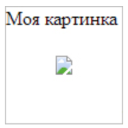
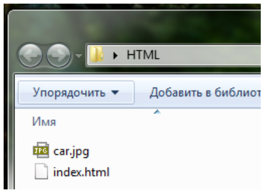
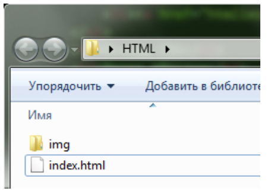
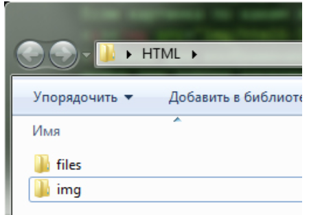
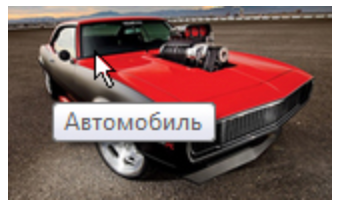

# 2.4. Вставка картинок. Тег &lt;img&gt;

Чтобы отобразить какую-нибудь картинку на веб-странице, необходим тег ``. Данный тег является одиночным и строчным, а также имеет два обязательных атрибута src и alt:

```text

```

При помощи атрибута **`src`** указывается путь к картинке. При помощи атрибута **`alt`** указывается альтернативный текст для картинки. Если картинка по каким либо причинам не отобразится на веб-странице, то вместо нее вы увидите альтернативный текст:



Также для изображения рекомендуется указывать ширину и высоту, это позволит браузеру быстрее загружать изображения на веб-страницу. Указывать ширину и высоту можно при помощи каскадных таблиц стилей, либо при помощи атрибутов `width` \(ширина\) и `height` \(высота\):

```text

```

Единицами измерения по умолчанию служат пиксели, и в html-коде для ширины и высоты изображения их указывать не нужно.


### ⚙ Как записать путь к изображению

Если изображение и файл, в котором прописан путь к этому изображению, лежат в одной папке:



то путь будет состоять из названия изображения и его расширения:

```text

```

Если картинку перенести в папку _img_: 




то путь к ней будет начинаться с названия папки, в которой она находится:

```text

```

Если файл _index.html_ поместить в папку _files_:




то путь к изображению будет начинаться с конструкции  **. . /**:

```text

```

Если папку _files_, содержащую файл _index.html_ положить еще в одну папку, то путь станет таким:

```text

```

и т.д.

### ⚙ Всплывающая подсказка

В этом уроке познакомимся с еще одним очень полезным атрибутом, который можно применять практически ко всем тегам – это атрибут title, он служит для отображения всплывающей подсказки. Например:

```text

```

Если навести курсор на картинку, то появится всплывающая подсказка:



#### 

### ⚙ Форматы графических изображений

Существует множество различных графических форматов, но браузеры поддерживают лишь несколько. Рассмотрим их.



**JPEG**  \(Joint Photographic Experts Group, объединённая группа экспертов-фотографов\).

Популярный формат графических файлов, широко применяемый при создании сайтов и для хранения фотографий. JPEG поддерживает 24-битный цвет и сохраняет яркость и оттенки цветов в фотографиях неизменными. Данный формат называют сжатием с потерями, поскольку алгоритм JPEG выборочно отвергает данные. Метод сжатия может внести искажения в изображение, особенно содержащий текст, мелкие детали или чёткие края. Формат JPEG не поддерживает прозрачность. Когда вы сохраняете фотографию в этом формате, прозрачные пиксели заполняются указанным цветом.

**Особенности:**

* Количество цветов в изображении — примерно 16,7 миллионов, что вполне достаточно для сохранения фотографического качества изображения.
* Основная характеристика формата — «качество», позволяющее управлять конечным размером файла. Качество измеряется от 0 до 100, чем выше значение, тем лучше получается картинка, но и увеличивается объём файла.
* Поддерживает технологию, так называемый прогрессивный JPEG, в котором версия рисунка с низким разрешением появляется в окне просмотра до полной загрузки самого изображения.

**Область применения:**  Используется преимущественно для фотографий. Не очень подходит для рисунков содержащих прозрачные участки, мелкие детали или текст.

**Файлы этого формата имеют расширения jpg, jpe, jpeg.**



Формат GIF \(Graphics Interchange Format\).

 Главное достоинство этого формата возможность хранить сразу несколько изображений в одном файле. Это позволяет создавать целый анимированные ролики. Во-вторых он поддерживает прозрачность. Главный недостаток это поддержка всего лишь 256-цветов, что никуда не годится для хранения фотографий. GIF в основном используется для хранения логотипов, баннеров, изображения с прозрачными участками и содержащих текст. Файлы этого формата имеют расширение gif.

**Особенности:**

* Количество цветов в изображении может быть от 2 до 256, но это могут быть любые цвета из 24-битной палитры. Файл в формате GIF может содержать прозрачные участки. Если используется отличный от белого цвета фон, он будет проглядывать сквозь «дыры» в изображении.
* Поддерживает покадровую смену изображений, что делает формат популярным для создания простой анимации.
* Использует свободный от потерь метод сжатия

**Область применения:** текст, логотипы, иллюстрации с чёткими краями, анимированные рисунки, изображения с прозрачными участками, баннеры.



**PNG-8\(Portable Network Graphics, переносимая сетевая графика\)** — свободный формат созданный для замены GIF, в котором долгое время использовались проприетарные алгоритмы.

**Особенности PNG-8:**

* Использует 8-битную палитру \(256 цветов\) в изображении, за что и получил в своем названии цифру восемь. При этом можно выбирать, сколько цветов будет сохраняться в файле — от 2 до 256.
* В отличие от GIF, не отображает анимацию.



**Формат PNG-24** — формат, аналогичный PNG-8, но использующий 24-битную палитру цвета Подобно формату JPEG, сохраняет яркость и оттенки цветов в фотографиях. Подобно GIF и формату PNG-8, сохраняет детали изображения, как, например, в линейных рисунках, логотипах или иллюстрациях.

**Особенности PNG-24:**

* Использует примерно 16,7 млн. цветов в файле, из-за чего этот формат применяется для полноцветных изображений.
* Поддерживает многоуровневую прозрачность, это позволяет создавать плавный переход от прозрачной области изображения к цветной.
* Из-за того, что используемый алгоритм сжатия сохраняет все цвета и пиксели в изображении неизменными, если сравнивать с другими форматами, то у PNG-24 конечный объём графического файла получается наибольшим.

**Область применения:** Фотографии, рисунки, содержащие прозрачные и полупрозрачные участки, рисунки с большим количеством цветов и чёткими краями изображений.



**Формат SVG \(Scalable Vector Graphics, масштабируемая векторная графика\)** — векторный формат, изображение в котором состоит не из пикселей, а из объектов и кривых. По этой причине не годится для растровых фотографий, состоящих из точек, но прекрасно подходит для иллюстраций, содержащих отчётливые контуры.

**Особенности:**

* Изображения в формате SVG можно сколь угодно масштабировать без потери качества картинки.
* Объём файла получается обычно небольшим.
* Поддерживает анимацию и интерактивность.

**Область применения:** Текст, логотипы, иллюстрации с чёткими краями.



#### 

#### Итого по форматам:

* **JPEG** лучше всего использовать для хранения фотографий или полутоновых картинок не содержащих текста;
* **GIF** используется в основном для анимации;
* **PNG**  формат для всего остального \(иконки, кнопки и др.\).
* **SVG** четкость картинки + небольшой размер

